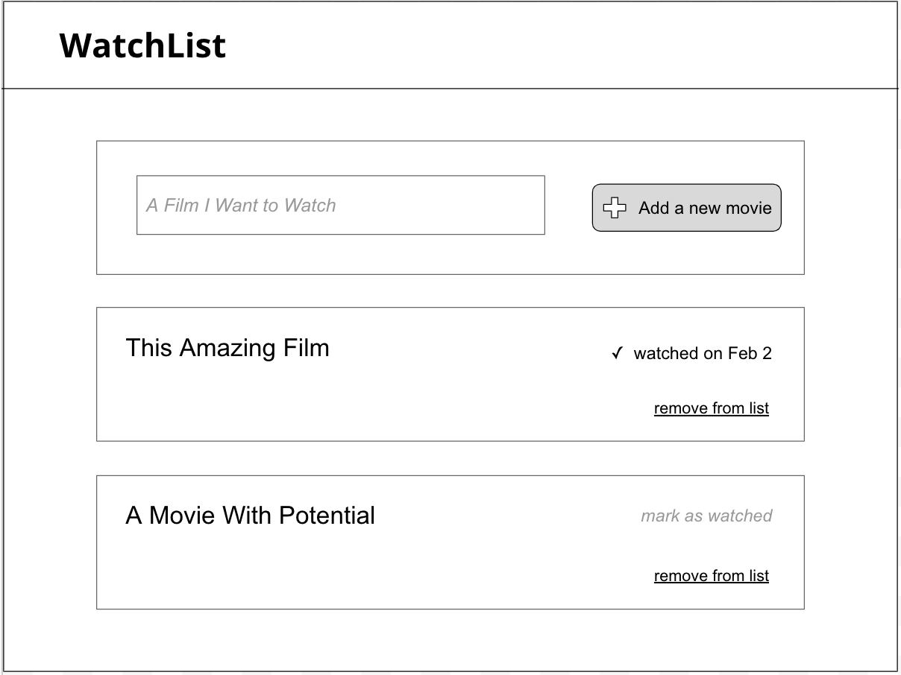

# Team-Coding: Movie Watching List App

Today we shall "team code" a single-page application for listing movies or shows you want to watch. "Mob programming" is a strategy for writing code with multiple contributors -- a little like pair programming, but you have more than two people. We'll use that idea to code together using VS Code's LiveShare.

The app you are building is similar to your note-taking app or the todo app we made in class. You'll use live-server for the front-end and json-server to store data. The data will be updated on the page using AJAX and plain vanilla JS.

A user should be able to enter a new movie, see a list of all their movies, and mark movies as watched.

Movies have a title, a boolean indicating whether it has been watched or not, a human-readable date created, and, if marked as watched, a human-readable date that it was marked as watched. These dates should _not_ be user-editable but set programmatically when a movie is saved or edited.

CSS is not important in this project, but you can add minimal styling as needed. Basic styling is being provided with [PicnicCSS](https://picnicss.com/), and a `style.css` is included in the repo.

**You may not be able to get to everything** so make some decisions about where to start and what to do later.

## Product Roadmap and Requirements

- Clone the repo and run `npm install`.
- Copy the `sample-db.json` to `db.json`.
- Run `npm start` to run live-server and json-server together (just like you did for the notes app).
- Create a form to allow a user to add a new movie. New movies are by default marked as not watched when they are added.
- Show a list of existing movies with watched or not watched indicated somehow. Watched movies should show the date they were watched.
- Allow a user to mark a movie as watched.
- BONUS FEATURES to consider
  - Display the movie list sorted in alphabetical order.
  - Allow users to show only watched or unwatched movies.
  - Allow users to edit movie titles.
  - Add a description field to let users add notes about a movie.

## Team Programming Rules

Each person must _verbally_ contribute to the code being written, but only one person at a time is typing. As always, our discussion will be guided by our respect for each other and our focus on creating a safe and productive learning space.

**The Goal**: A working app by Tuesday, using only class time to do it together.

We will switch roles every 10 minutes.

Some things to keep in mind:

- **It's 100% ok to be wrong about something.**
  - AND it's better to be wrong than to say or do nothing.
- **It's 100% ok not to know something.**
  - AND it's better to try things that _might_ work than wait until you're sure about what _will_ work.
- **Try things even if you are not sure they are right.**
- **Move steadily and be decisive even if you are uncertain.**
- **Run code in the console to test your ideas.**
- **Use `console.log` and `debugger`**
- **Just jump in and throw out some ideas! Ideas keep everyone moving forward, which is one of our goals.**

### The roles

**The Driver** This person shares their screen and does the typing. In this role, they serve as a conduit for the ideas of the group, implementing what the Navigator asks them to. The driver writes the code that has been suggested by the team.

**The Navigator** The navigator leads the way, making decisions based on the input of the group about what to do and giving direction about what to type to the driver. They may ask the rest of the team for help as needed.

**The Moderator** The job of the moderator is to keep everyone focused and on track and be sure everyone is particupating and that all voices are heard. This person leads the discussion, asks pertinent questions to generate ideas, and keeps things moving forward in cooperation with the Navigator.

**The Scout** This person is responsible for looking up syntax or documentation and may be asked to do that by anyone on the team. They may also make suggestions for things to try if they come across relevant examples in the documentation.

**The Individual Contributors** These developers make suggestions and offer helpful advice as needed. The moderator may ask them directly for their input and make room for their contributions to the discussion.

### Role assignments

We'll shift roles at 10-minute intervals. Each person will have a chance to occupy every role. When we reach the last shift, we will start over and repeat the cycle.

If anyone needs to take a break or step away, their role can be filled by one of the Individual Contributors for that round.

At the beginning of each shift, pull down all the code from the repo. The driver should share their screen (or live share in vs code).

At the end of each shift, add, commit, and push all the code that has been written.

#### shift 1

- driver: Em
- navigator: Joe
- moderator: Sarah
- scout: Connor
- contributors: Brian, Andrea

#### shift 2

- driver: Brian
- navigator: Andrea
- moderator: Em
- scout: Joe
- contributors: Connor, Sarah

#### shift 3

- driver: Connnor
- navigator: Sarah
- moderator: Andrea
- scout: Em
- contributors: Brian, Joe

#### shift 4

- driver: Joe
- navigator: Brian
- moderator: Connor
- scout: Andrea
- contributors: Sarah, Em
#### shift 5

- driver: Sarah
- navigator: Em
- moderator: Joe
- scout: Connor
- contributors: Andrea,Brian

#### shift 6

- driver: Andrea
- navigator: Joe
- moderator: Brian
- scout: Sarah
- contributors: Connor, Em

#### shift 7 -> start over at shift 1

